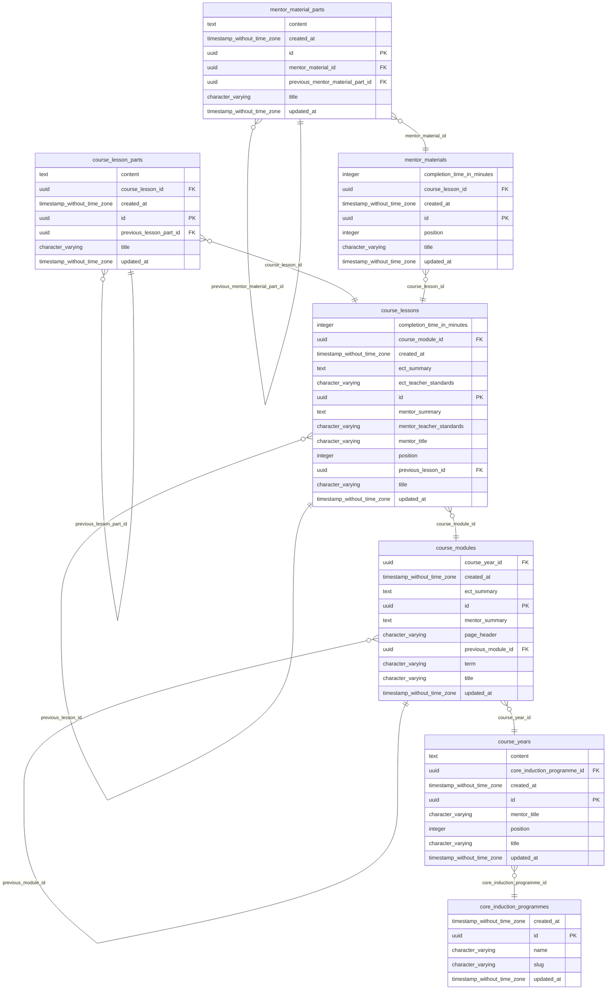

# Support for ECT CMS extractor 🚛

This is a program which will convert the content from [Support for early career teachers](https://support-for-early-career-teachers.education.gov.uk/) into plain Markdown. It will be short lived and discarded once the migration is done.

The data is stored in a database and has a custom CMS built in Rails. It is clunky, complicated and unmaintained.

Moving it to a static website will make maintaining and updating it easier and remove the cost and complexity required to host it.

See [extract.rb](extract.rb) for more details.

## CMS Schema

